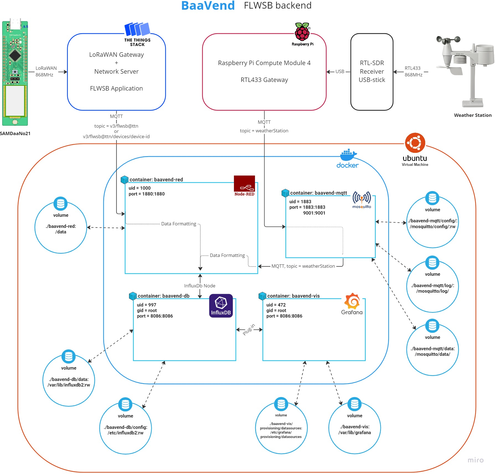

# BaaVend Backend

## Introductie

De BaaVend is de naam voor de backend van dit project.
Het bestaat uit services, voor zowel backend als frontend, in Docker containers opgezet met Docker-Compose.
Voor LoRaWAN connectiviteit wordt gebruik gemaakt van The Things Network (TTN).
In dit hoofdstuk wordt de backend acrhitectuur beschreven, de algemende werking, hoe deze is opgezet, en hoe de connectiviteit naar buiten de Docker omgeving toe werkt.
Vervolgens wordt er ingezoomed op de verschillende backend specifieke onderdelen, zijnde Node-RED, InfluxDb en Mosquitto.
Als laatste worden de aanwezige beveiligingsmaatregelen beschreven.
De frontend bestaat uit Grafana en Node-Red Dashboard. De werking hiervan wordt in het Frontend hoofdstuk beschreven.

---

## Architectuur

In dit onderdeel wordt de architectuur van de backend beschreven.
Als referentie is er onderstaand een blokdiagram met een algemeen overzicht van de structuur.

### Blokdiagram

<iframe width="600" height="600" src="https://miro.com/app/embed/uXjVPAdIy0o=/?pres=1&frameId=3458764539639092323&embedId=517984770656" frameborder="0" scrolling="no" allowfullscreen></iframe>




### Services

- The Things Stack FLWSB applicatie (extern op TTN) voor LoRaWAN ontvangst.
- baavend-red: [Node-RED](https://flows.nodered.org/) container voor dataverwerking en alles te verbinden.
- baavend-db: [InlfuxDb v2.5](https://www.influxdata.com/blog/running-influxdb-2-0-and-telegraf-using-docker/) container als database voor de meetresultaten.
- baavend-mqtt: [Mosquitto](https://github.com/vvatelot/mosquitto-docker-compose) container als MQTT broker voor het weerstation.
- baavend-vis: [Grafana](https://grafana.com/oss/grafana/) container met frontend web applicatie voor data visualisatie.

#### Docker-Compose file

```yaml
version: "3"
services:
    nodered:
        depends_on:
            - influxdb
            - mosquitto
        build:
          context: .
          dockerfile: Dockerfile-nodered
        container_name: baavend-red #you can give another name here
        networks:
            - net
        ports:
            - 1880:1880
        links:
           - "influxdb:db"  # the container influxdb is reachable as the hostnames "influxdb" and "db" through this container.
        environment:
            - TZ=Europe/Brussels
        volumes:
            - ./baavend-red:/data
            - ./nodered-flows.json:/data/flows.json:rw
            - ./nodered-flows_cred.json:/data/flows_cred.json:rw
            - ./nodered-settings.js:/data/settings.js:ro
        restart: on-failure:10

    influxdb:
        image: influxdb:latest
        container_name: baavend-db
        networks:
            - net
        ports:
            - 8086:8086   # https://localhost:8086
        volumes:
            - ./baavend-db/data:/var/lib/influxdb2:rw
            - ./baavend-db/config:/etc/influxdb2:rw
            # - ./entrypoint.sh:/docker-entrypoint-initdb.d/entrypoint.sh
            # - ./influxdb-ssl/influxdb-selfsigned.crt:/etc/ssl/influxdb-selfsigned.crt:rw
            # - ./influxdb-ssl/influxdb-selfsigned.key:/etc/ssl/influxdb-selfsigned.key:rw
        env_file:
            - influxdb.env
        restart: on-failure:10

    mosquitto:
        image: eclipse-mosquitto:latest
        container_name: baavend-mqtt
        networks:
            - net
        ports:
            - 1883:1883
            - 9001:9001
        volumes:
            - ./baavend-mqtt/config/:/mosquitto/config/:rw
            - ./mosquitto.conf:/mosquitto/config/mosquitto.conf:rw
            - ./mosquitto-password.txt:/mosquitto/config/password.txt:rw
            - ./baavend-mqtt/log/:/mosquitto/log/
            - ./baavend-mqtt/data:/mosquitto/data/
        restart: on-failure:10

    grafana:
        depends_on:
          - nodered
          - influxdb
        image: grafana/grafana:latest
        container_name: baavend-vis
        networks:
            - net
        ports:
          - 3000:3000
        links:
            - "nodered:api"  # http://api:1880/flwsb-api/v1/
            - "influxdb"     # http://influxdb:8086
        env_file:
            - grafana.env
        volumes:
          - ./baavend-vis/provisioning/datasources:/etc/grafana/provisioning/datasources
          - ./baavend-vis:/var/lib/grafana
        restart: on-failure:10

networks:
   net:

```

### Connectiviteit

Als connectiviteit wordt er gebruik gemaakt van __MQTT__ om data van The Things Network binnen te halen zowel als van het weerstation.

#### MQTT

MQTT wordt gebruikt om de data van de metingen te verkrijgen.
Dit gebeurd door op een endpoint te subscriben met een MQTT node in Node-RED.

Uit The Things Stack FLWSB applicatie kan dit als volgt:
```javascript
// Structure
v3/applicatie-naam@ttn/devices/board-name/up

// Example
v3/flwsb@ttn/devices/device-test/up
```

Voor het weerstation wordt een eigen MQTT broker opgezet met Mosquitto.
Hiervoor is het endpoint bijvoorbeeld

```javascript
// Structure
sensors/rtl_433/Bresser-5in1/Alecto-id/measurement-quantity_unit

// Examples
sensors/rtl_433/Bresser-5in1/100/temperature_C
sensors/rtl_433/Bresser-5in1/100/humidity
```


## Docker op Linux Virtual Machine

*[DigitalOcean droplet (baavend-ubuntu-s-1vcpu-1gb-intel-ams3-01)](https://cloud.digitalocean.com/droplets/328289429/graphs?i=8bcdff&period=hour) IP: 167.71.75.179*


Bij het opstarten van de __Node-RED__ en __Grafana__ containers op een Linux Virtual Machine kan je stuiten op permission errors.

Dit gebeurt omdat er volumes gemount worden en de user van de Docker container geen rechten heeft om in de directories van de host user te schrijven.

Om deze error op te lossen moet er dus schrijf rechten gegeven worden aan de uid van de specifieke container, zoals beschreven in [deze oplossing op stackoverflow](https://stackoverflow.com/questions/74487200/can-i-run-node-red-under-docker-on-vm-eflow-azure-iot-edge-on-windows-device/74488060#74488060).

### Node-RED

Bij Node-RED is de error als volgt:

```bash
baavend-red  | <date time> - [error] Failed to start server:
baavend-red  | <date time> - [error] Error: EACCES: permission denied, mkdir '/data/node_modules'
```

Voor Node-RED is de container user uid 1000.
Voor baavend-red wordt het commando:

```bash
sudo chown -R 1000:1000 ~/baavend/baavend-red/
```

### Grafana

Bij Grafana is de error als volgt:

```bash
baavend-vis  | GF_PATHS_DATA='/var/lib/grafana' is not writable.
baavend-vis  | You may have issues with file permissions, more information here: http://docs.grafana.org/installation/docker/#migrate-to-v51-or-later
baavend-vis  | mkdir: can't create directory '/var/lib/grafana/plugins': Permission denied
...
```

Zoals beschreven in [de link die gegeven wordt bij de error](http://docs.grafana.org/installation/docker/#migrate-to-v51-or-later) kan de uid van de container verschillend zijn afhankelijk van versie van Grafana die gebruikt wordt.

> User ID changes
In Grafana v5.1, we changed the ID and group of the Grafana user and in v7.3 we changed the group. Unfortunately this means that files created prior to v5.1 won’t have the correct permissions for later versions. We made this change so that it would be more likely that the Grafana users ID would be unique to Grafana. For example, on Ubuntu 16.04 104 is already in use by the syslog user.

| Version | User | User ID | Group | Group ID |
| --- | --- | --- | --- | --- |
| < 5.1 | grafana | 104	| grafana |	107 |
| >= 5.1 | grafana | 472 | grafana | 472 |
| >= 7.3 | grafana | 472 | root | 0 |

> There are two possible solutions to this problem. Either you start the new container as the root user and change ownership from 104 to 472, or you start the upgraded container as user 104.

Er zijn dus verschillende opties.
Volgende commando werkt voor baavend-vis:

```bash
sudo chown -R 104:104 ~/baavend/baavend-vis/
sudo chown -R 472:472 ~/baavend/baavend-vis/
```

---
