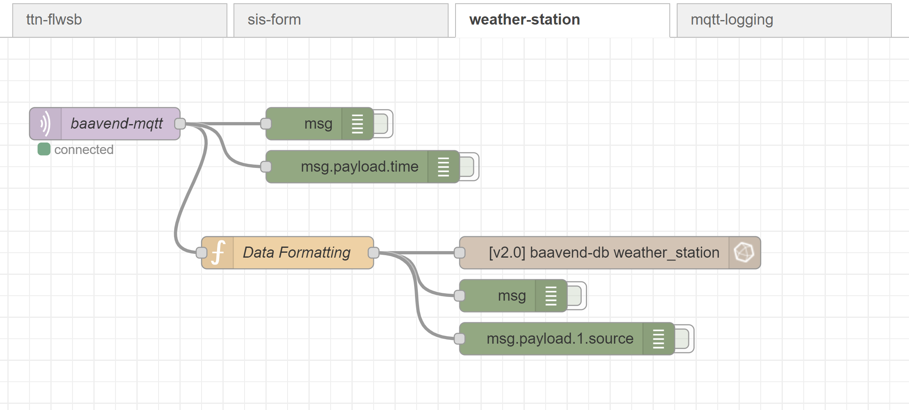

# Backend

## Mosquitto MQTT Broker


## Troubleshooting

### Verbinden met de broker werkt niet.

Een probleem waar mogelijks op gestuit wordt is dat de config files niet geschreven zijn en er dus geen authenticatie mogelijk is.

Als docker nog nooit opgestart is kan het voldoende zijn om de map `baavend-mqtt` aan te maken met de [uid 1883](https://github.com/eclipse/mosquitto/issues/1031) toegekend. Hierdoor heeft de container het recht naar het volume op de host te schrijven. Dit kan je doen met volgende commandos:

```bash
mkdir ~/baavend/baavend-vis/
sudo chown -R 18832:1883 ~/baavend/baavend-vis/
```

Voor andere gevallen moeten de config files handmatig in het volume geschreven worden met `sudo`.

### Berichten komen niet aan.

Dit ge-troubleshoot worden met de software [MQTT Explorer](http://mqtt-explorer.com/).
Met deze tool kan je monitoren wat er gebeurt in de broker.


In het voorbeeld is te zien dat er data van het weerstation binnenkomt op topic **weatherStation**.
*Wij hadden eerst het topic in onze Node-Red gezet op **/weatherStation**, waardoor we natuurlijk niets ontvangde.*

Merk op dat er hier ook verschillende structuren van berichten toekomen op hetzelfde topic.
Er zijn namelijk twee varianten berichten die van het weerstation komen. Eén waar *temperature_C* en *humidity* in zitten, en een tweede waar deze ontbreken maar in de plaats *rain_mm* in zit.

Er kan ook altijd nog extra getest worden in Node-Red door zelf berichten op het topic te sturen en aan de hand van debug nodes (debug = groen).


