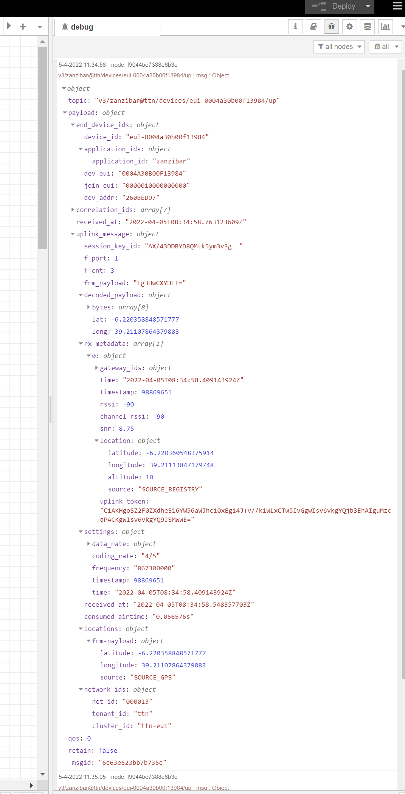

## Data Structuur

In dit onderdeel wordt bekeken hoe de data vanuit The Things Network in de backend binenkomt. Hoe de data in de database kan worden opgeslagen en hoe dit dan effectief zal gebeuren.

### The Things Network (TTN) & The Things Stack applicatie

De data die ontvangen wordt via MQTT uit de TTN applicatie is een JSON object die de bitstream bevat van het FLWSB-board, maar ook nog een hoop extra informatie aangeleverd door TTN. In onderstaand code block staat de beschrijving van elk onderdeel van een uplink message.

```javascript
{
  "end_device_ids" : {
    "device_id" : "dev1",                    // Device ID
    "application_ids" : {
      "application_id" : "app1"              // Application ID
    },
    "dev_eui" : "0004A30B001C0530",          // DevEUI of the end device
    "join_eui" : "800000000000000C",         // JoinEUI of the end device (also known as AppEUI in LoRaWAN versions below 1.1)
    "dev_addr" : "00BCB929"                  // Device address known by the Network Server
  },
  "correlation_ids" : [ "as:up:01...", ... ],// Correlation identifiers of the message
  "received_at" : "2020-02-12T15:15..."      // ISO 8601 UTC timestamp at which the message has been received by the Application Server
  "uplink_message" : {
    "session_key_id": "AXA50...",            // Join Server issued identifier for the session keys used by this uplink
    "f_cnt": 1,                              // Frame counter
    "f_port": 1,                             // Frame port
    "frm_payload": "gkHe",                   // Frame payload (Base64)
    "decoded_payload" : {                    // Decoded payload object, decoded by the device payload formatter
      "temperature": 1.0,
      "luminosity": 0.64
    },
    "rx_metadata": [{                        // A list of metadata for each antenna of each gateway that received this message
      "gateway_ids": {
        "gateway_id": "gtw1",                // Gateway ID
        "eui": "9C5C8E00001A05C4"            // Gateway EUI
      },
      "time": "2020-02-12T15:15:45.787Z",    // ISO 8601 UTC timestamp at which the uplink has been received by the gateway
      "timestamp": 2463457000,               // Timestamp of the gateway concentrator when the message has been received
      "rssi": -35,                           // Received signal strength indicator (dBm)
      "channel_rssi": -35,                   // Received signal strength indicator of the channel (dBm)
      "snr": 5.2,                            // Signal-to-noise ratio (dB)
      "uplink_token": "ChIKEA...",           // Uplink token injected by gateway, Gateway Server or fNS
      "channel_index": 2                     // Index of the gateway channel that received the message
      "location": {                          // Gateway location metadata (only for gateways with location set to public)
        "latitude": 37.97155556731436,       // Location latitude
        "longitude": 23.72678801175413,      // Location longitude
        "altitude": 2,                       // Location altitude
        "source": "SOURCE_REGISTRY"          // Location source. SOURCE_REGISTRY is the location from the Identity Server.
      }
    }],
    "settings": {                            // Settings for the transmission
      "data_rate": {                         // Data rate settings
        "lora": {                            // LoRa modulation settings
          "bandwidth": 125000,               // Bandwidth (Hz)
          "spreading_factor": 7              // Spreading factor
        }
      },
      "coding_rate": "4/6",                  // LoRa coding rate
      "frequency": "868300000",              // Frequency (Hz)
    },
    "received_at": "2020-02-12T15:15..."     // ISO 8601 UTC timestamp at which the uplink has been received by the Network Server
    "consumed_airtime": "0.056576s",         // Time-on-air, calculated by the Network Server using payload size and transmission settings
    "locations": {                           // End device location metadata
      "user": {
        "latitude": 37.97155556731436,       // Location latitude
        "longitude": 23.72678801175413,      // Location longitude
        "altitude": 10,                      // Location altitude
        "source": "SOURCE_REGISTRY"          // Location source. SOURCE_REGISTRY is the location from the Identity Server.
      }
    },
    "version_ids": {                          // End device version information
        "brand_id": "the-things-products",    // Device brand
        "model_id": "the-things-uno",         // Device model
        "hardware_version": "1.0",            // Device hardware version
        "firmware_version": "quickstart",     // Device firmware version
        "band_id": "EU_863_870"               // Supported band ID
    },
    "network_ids": {                          // Network information
      "net_id": "000013",                     // Network ID
      "tenant_id": "tenant1",                 // Tenant ID
      "cluster_id": "eu1"                     // Cluster ID
    }
  },
  "simulated": true,                         // Signals if the message is coming from the Network Server or is simulated.
}
```
[_Bron: The Things Stack v3.22.0 - Reference - Data Formats - JSON Payload_](https://www.thethingsindustries.com/docs/reference/data-formats/)

_Note: Deze data blijkt wel niet helemaal up-to-date. De informatie van de Identity Server moet worden opgehaald uit een API. Dit is de locatie die handmatig kan worden ingesteld op The Things Stack applicatie. De end device location metadata heeft ook een ander formaat, zie onderstaande code block en Figuur 1._

Het meeste van deze informatie is niet nuttig voor dit project en zal dus niet worden bijgehouden. Wat wel zal bijgehouden worden is:

- ```payload/device-id```: het id toegekend in The Things Stack applicatie.
- ```payload/frm_payload```: de verzonden bitstream.
- ```payload/rx_metadata/0/time```: tijd waarop de gateway het bericht ontvangen heeft.
- ```payload/locations/frm-payload/latitude & longitude```: coördinaten van het FLWSB-board, automatisch ingesteld door TTN.

```javascript
{
   topic: "v3/flwsb@ttn/devices/<device_id>/up",
   payload: {
      end_device_ids: {
         device_id: "<device-id>",
         // ...
      received_at: "<timestamp, ISO 8601 YYYY-MM-DDTHH:mm:ss.sssZ>",
      uplink_message: {
          // ...
          frm_payload: "<bitstream (base64)>",
          // ...
          rx_metadata: {
            0: {
              // ...
              time: "<timestamp, ISO 8601 YYYY-MM-DDTHH:mm:ss.sssZ>"
              // ...
            }
          },
          // ...
          locations: {
            frm_payload: {
                    latitude: 37.97155556731436,  // coördinaat, float
                    longitude: 23.72678801175413  // coördinaat, float
                }
            }
          },
    // ...
}
```


_Figuur 1.: TTN uplink message in Node-RED, Zanzibar Project 2022_

---

### InfluxDb

InfluxDb 2.0 is de database die gebruikt wordt. Het is een open-source Time Series Database (TSDB) geschreven in de GO programeertaal. Meer uitleg kan gevonden worden in het hoofdstuk Backend, onderdeel InfluxDb.

Het belangrijkste is dat deze zeer geschikt is om data gebonden aan tijd bij te houden. Ideaal dus om metingen van sensoren bij te houden en tendensen te kunnen visualiseren. Verder heeft het ook een handig tagging systeem om het Sensor Identification System aan de data te koppelen.

#### Schema Design

De InfluxDb documentatie heeft een onderdeel over InfluxDb schema design onder [Write data - Best practices- Schema design](https://docs.influxdata.com/influxdb/v2.4/write-data/best-practices/schema-design/).

InfluxDb bestaat uit volgende onderdelen:

<table style="width: 100%">
    <colgroup>
        <col span="0" style="width: 15%;">
        <col span="1" style="width: 15%;">
        <col span="2" style="width: 50%;">
        <col span="3" style="width: 30%;">
    </colgroup>
    <tr>
        <th>Naam (Name)</th>
        <th>Datatype</th>
        <th>Beschrijving</th>
        <th>Voorbeeld (Example)</th>
    </tr>
    <tr>
        <td>
            bucket
        </td>
        <td>
            string
        </td>
        <td>
            Benoemde locatie waar time series data wordt opgeslagen. Vergelijkbaar met een collection in MongoDb of een relationele database op zichzelf. Het kan automatisch datapunten gaan verwijderen afhankelijk van hoe oud ze zijn. Dit is data persistence. <br>
            Vb. 6 maanden, of 2 jaar. Dit is de retention period. <br>
            <i>Bevat measurements.</i>
        </td>
        <td>
            flwsb <br>
            sis
        </td>
    </tr>
    <tr>
        <td>
            _measurement
        </td>
        <td>
            string
        </td>
        <td>
            Elke measurement is een simpele naam dat een schema en de data in de fields beschrijft.
            Vergelijkbaar met een document in MongoDb, of een tabel in een relationele database. <br>
            <i>Bevat fields, tags en timestamps.</i>
        </td>
        <td>
            airSensor
        </td>
    </tr>
    <tr>
        <td>
            _field
        </td>
        <td>
            string: string/double/int
        </td>
        <td>
            Field key-value pairs hebben een naam en bevatten numerische data. De key houd metadata bij en de value houd unieke of sterk variabele data bij verbonden aan een timestamp. <br>
            <i>Fields worden niet geïndexeerd, lees niet performant in queries.</i>
        </td>
        <td>
            temperature: 22.5
        </td>
    </tr>
    <tr>
        <td>
            tag
        </td>
        <td>
            string: string
        </td>
        <td>
            Tag key-value pairs voegen metadata toe die meerdere datapunten met elkaar linken. <br>
            <i>Tag keys en values worden geïndexeerd, lees performant in queries.</i>
        </td>
        <td>
            tags: { <br>
              location: "home", <br>
              sensor: "bme280" <br>
            }
        </td>
    </tr>
    <tr>
        <td>
            _time / timestamp
        </td>
        <td>
            Datetime:RFC3339
        </td>
        <td>
            Standaard de tijd wanneer het datapunt wordt toegevoegd, in nanoseconden. Kan worden meegegeven bij het wegschrijven en in miliseconden wanneer gespecificeerd.
        </td>
        <td>
            2022-10-28T16:43:56.175Z
        </td>
    </tr>
</table>


_**Keys** herhalen niet binnen een schema en kunnen geen gereserveerde keywords zijn of speciale tekens bevatten._

_**Measurements** en **keys** bevatten geen data; **tag values** en **field values** bevatten wel data._

_Een **datapunt / point** bevat een series key, een field value en een timestamp.
vb. ```2019-08-18T00:00:00Z census ants 30 portland mullen```. Waarbij measurement = census, field key = ants, field value = 30, location tag = portland, en scientist tag = mullen._

_Een **series key** is een collectie van datapunten dat een measurement, tag set en field key delen.
Een **series** bevat timestamps en field values voor een bepaalde series key._

[_Bron: InlfuxDb data elements_](https://docs.influxdata.com/influxdb/cloud/reference/key-concepts/data-elements/#bucket)

<br>

#### Voorbeelden

Onderstaand zijn twee voorbeelden hoe data vanuit Node-RED naar de database kan gestuurd worden en hoe deze gestructureerd kunnen worden.

__Output Node__

_If msg.payload is an array of arrays, it will be written as a series of points containing fields and tags. For example, the following flow injects two points into an InfluxDb 2.0 database with timestamps specified._

```javascript
msg.payload = [
    [{
        intValue: '9i',
        numValue: 10,
        randomValue: Math.random()*10,
        strValue: "message1",
        time: new Date().getTime()-1
    },
    {
        tag1:"sensor1",
        tag2:"device2"
    }],
    [{
        intValue: '11i',
        numValue: 20,
        randomValue: Math.random()*10,
        strValue: "message2",
        time: new Date().getTime()
    },
    {
        tag1:"sensor1",
        tag2:"device2"
    }]
];
return msg;
```
[Bron: Node-RED node-red-contrib-influxdb nodes documentatie.](https://flows.nodered.org/node/node-red-contrib-influxdb)

<br>

__Batch Output Node__

_The following example flow writes two points to two measurements, setting the timestamp to the current date._

```javascript
msg.payload = [
    {
        measurement: "weather_sensor",
        fields: {
            temp: 5.5,
            light: 678,
            humidity: 51
        },
        tags:{
            location:"garden"
        },
        timestamp: new Date()
    },
    {
        measurement: "alarm_sensor",
        fields: {
            proximity: 999,
            temp: 19.5
        },
        tags:{
            location:"home"
        },
        timestamp: new Date()
    }
];
return msg;
```
[Bron: Node-RED node-red-contrib-influxdb nodes documentatie.](https://flows.nodered.org/node/node-red-contrib-influxdb)


---

### Gekozen data structuur

#### bucket: sis

Data persistence: never

**_measurement: hardcoded**

```javascript
// FluxDb Output Node
msg.payload = [
  {
        sensor_name: "BME280",
        quantity: "temp, pressure, humidity",
        datatype: "int, int, int",
        unit: "°C; hPa; %",
        time: new Date().getTime()
    },
    {
        board_id: "board-1",  // device-id TTN en SIS
        sensor_id: 8
}];
return msg;
```

**_measurement: user_defined**

```javascript
// FluxDb Output Node
msg.payload = [
    [{
        sensor_name: "TaMM-o-Meter",
        quantity: "wind_speed",
        datatype: "float",
        unit: "m/s",
        time: new Date().getTime()
    },
    {
        board_id: "board-1",               // device-id TTN en SIS
        sensor_id: 1
    }]
];
return msg;
```

#### bucket: flwsb

Data persistence: never

**_measurement: climate_data**

```javascript
// FluxDb Output Node
msg.payload = [
    [{
        temp: '85i',                        // temperatuur, °C, int
        pressure: '1100i',                  // luchtdruk, hPa, int
        humidity: '100i',                   // luchtvochtigheid, %, int
        time: "2020-02-12T15:15:45.787Z"    // timestamp TTN
    },
    {
        board_id: "board-1",                // device-id TTN en SIS
        sensor: "BME280"
    }],
    [{
        wind_speed: 32.7,                   // wind snelheid, m/s, float
        time: new Date().getTime()
    },
    {
        board_id: "board-1",                // device-id TTN en SIS
        sensor: "TaMM-o-Meter"
    }],
    [{
        soil_moisture: '1023i',             // grondvochtigheid, analoge spanning, int
        time: new Date().getTime()
    },
    {
        board_id: "board-1",                // device-id TTN en SIS
        sensor: "TaMM-oisture"
    }],
    [{
        latitude: 37.97155556731436,       // TTN device location latitude
        longitude: 23.72678801175413,      // TTN device location longitude
        time: "2020-02-12T15:15:45.787Z"   // timestamp TTN
    },
    {
        board_id: "board-1"                // device-id TTN en SIS
    }]
];
return msg;
```

_Note: Locatie coördinaten toevoegen aan elke datapunt of enkel in SIS?_

**_measurement: weather_station**

```javascript
// FluxDb Output Node
msg.payload = [
  {
        temp: 60.0,                 // buiten temperatuur, °C, float
        humidity: '99i',            // buiten luchtvochtigheid, %, int
        wind_speed: 3.0,            // windsnelheid, m/s, float
        wind_gust: 6.0,             // windsnelheid, m/s, float
        wind_direction: '360i',     // windrichting, hoek in graden °, int
        rain: 1000.0,               // neerslag, mm/10min, float
        time: new Date().getTime()
    },
    {
        source: "weather-station-1"
}];
return msg;
```
