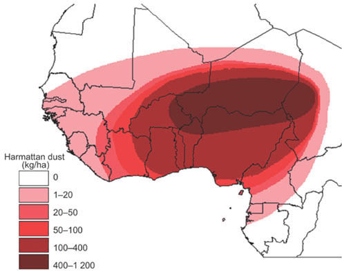
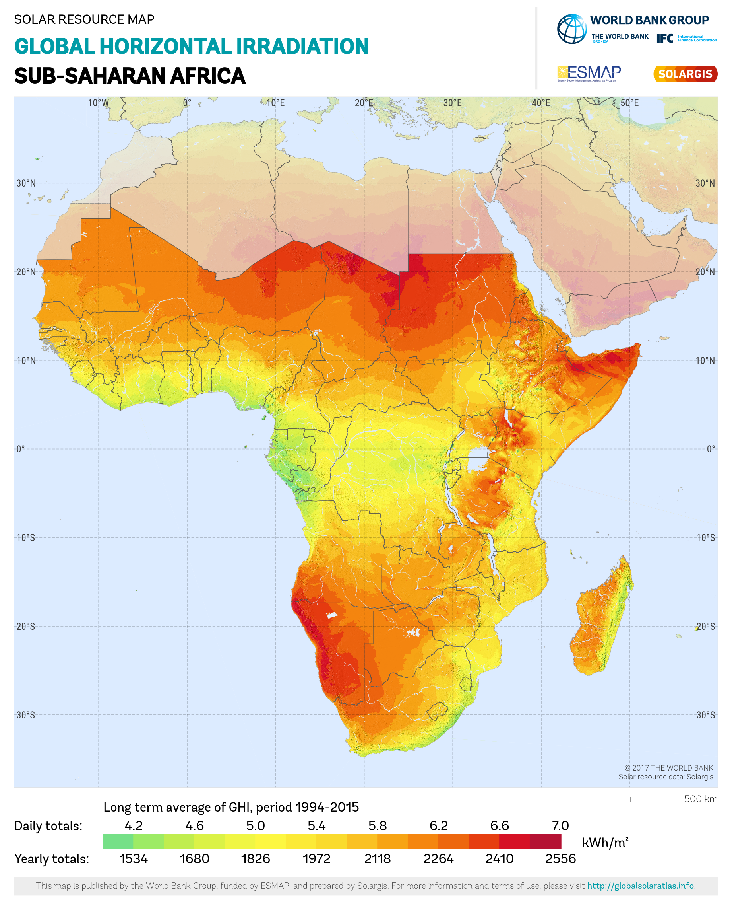
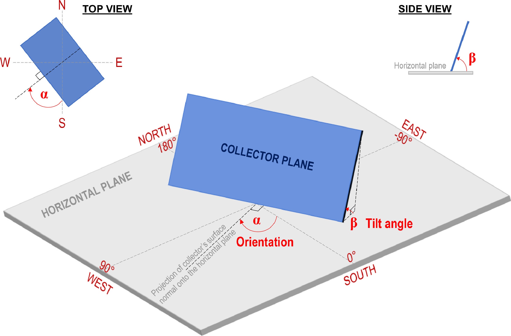
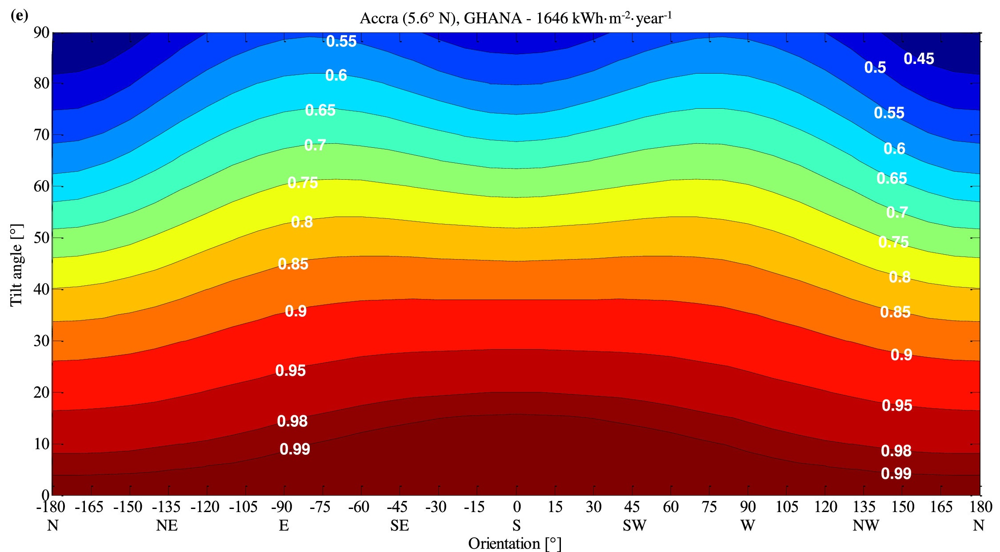
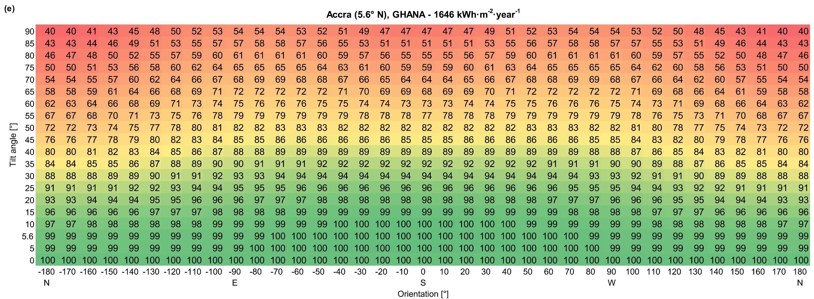
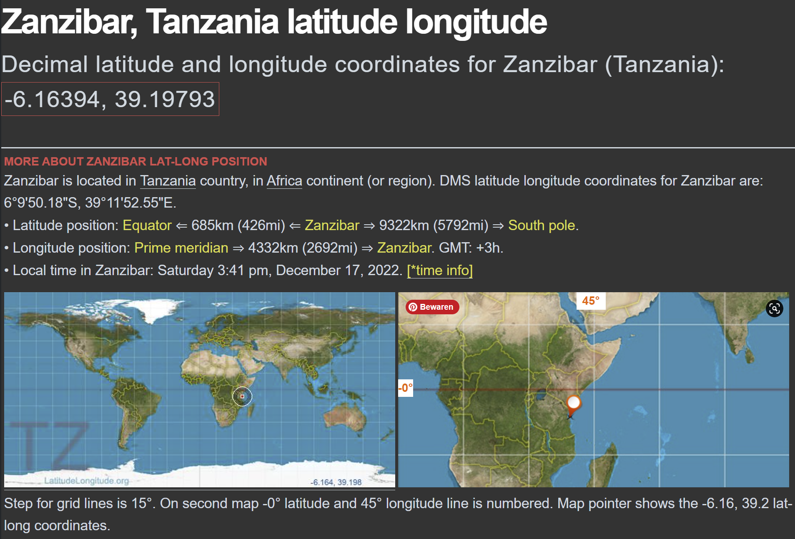
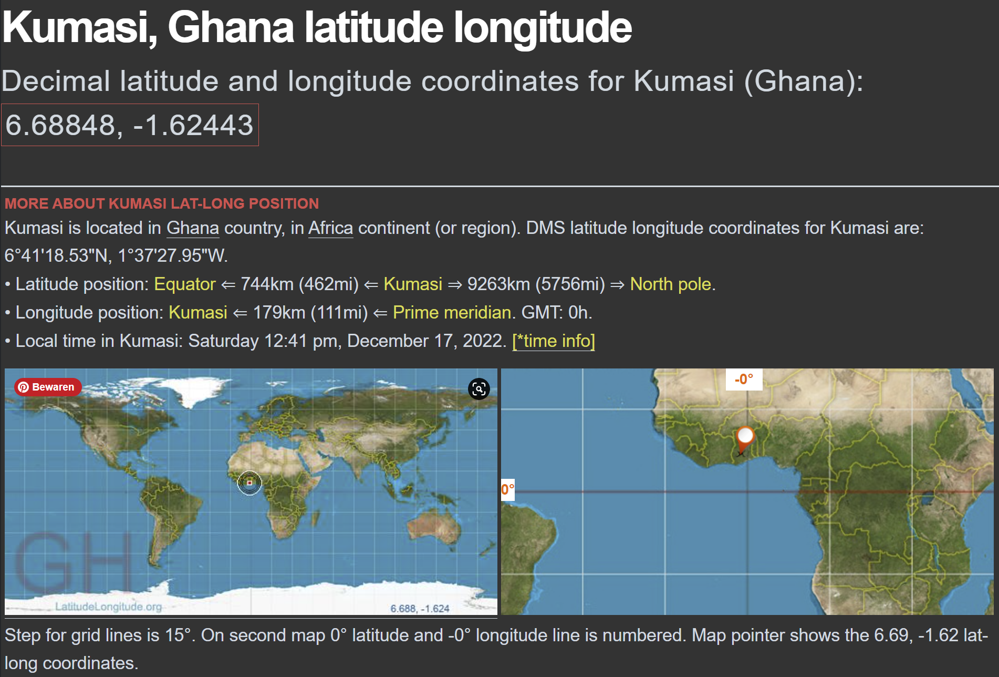

# Behuizing

## Zonne-energie

### Voeding met zonnepanelen

Voor dit project wordt er gebruik gemaakt van [kleine zonnepanelen van 110x80mm die elk 5V 200mA kunnen leveren](https://www.tinytronics.nl/shop/nl/power/zonne-energie/zonnepanelen/zonnepaneel-5v-200ma-110x80mm).
Aan de hand van een zonne-energie manager, besproken in het hoofdstuk Schematics in het onderdeel [Connector Board](./schematics/connector-board.md), kan de schakeling gevoed worden en een Li-Po Batterij opgeladen worden. Aan de hand van de [Li-Po Batterij 3.7V 1250mAh](https://www.tinytronics.nl/shop/nl/power/batterijen/li-po/li-po-accu-3.7v-1250mah-jst-ph-lp554050) kan de schakeling vervolgens gevoed worden in de nacht.

*Fig. Klein zonnepaneel 5V 200mA 110x80mm*

De zonne-energie-manager kan tot 5V 1A aan. Er kunnen dus tot maximaal vijf van deze zonnepanelen in parallel geschakeld worden om dit te bekomen. Om te kunnen inschatten hoeveel panelen we nodig hebben moet het stroomverbruik van de schakeling bepaald worden, zowel als de hoeveelheid zon op locatie in rekening worden gebracht.

*Fig. Zonnepanelen in serie of parallel*

Het verbruik wordt, in het hoofdstuk Schematics in het onderdeel [Connector Board](./schematics/connector-board.md) onder Stroomverbruik, bepaald op maximaal 143mA voor de veresite sensoren. Om ruimte te geven voor mogelijke uitbreidingen kan dit afgerond worden naar 250mA.

In zowel Tanzania als Ghana liggen de gemiddelde uren zon op een dag tussen de 12:30 en 13:15 uren, en dit tussen 6u 's morgens en 19u 's avonds. Waarbij de incident solar radiation variëert tussen 4 en 6 kWh/m²/day afhankelijk van het seizoen.

- [Zon data voor Zanzibar, Tanzania.](https://www.gaisma.com/en/location/zanzibar.html)
- [Zon data voor Kamusi, Ghana.](https://www.gaisma.com/en/location/kumasi.html)

Rekeninghoudend met een efficiëntie van 90%, en afgerond 12 uur zon per dag, heeft de batterij 93,75mAh nodig om volledig opgeladen te worden.

> (1250mAh / 12) * 90% = 104,167 * 90% = 93,75mAh

__In totaal wordt er dus 345mAh vereist.
*Twee* zonnepanelen die samen 360mAh kunnen leveren zou dus voldoende moeten zijn.__

> 250mA + 95mAh = 345mAh => 200mA * 2 * 90% = 360mAh

Op lange termijn moet er echter ook nog rekening gehouden worden met de degredatie van de zonnecellen. [Voor monokristallijne (zwarte) zonnepanelen bedraagt dit tussen de 19% tot 23%](https://zonnepanelenenergie.be/perc) over 25 jaar, afgerond 20%. Dan is er nog slechts 288mAh over. Er zal echter nooit het maximale stroomverbruik plaatsvinden voor een volledig uur. Dat zal slechts enkele seconden of minuten zijn, dus twee panelen zouden nog steeds ruim voldoende moeten zijn.

> 360mAh * 80% = 288mAh

### Zonne-energie in Sub-Sahara Afrika

Er zal gebruik gemaakt worden van zonne-energie panelen in combinatie met een heroplaadbare batterij om de schakeling te voeden. Hierdoor zouden de sensoren voor enkele jaren autonoom moeten kunnen functioneren.

Uit een recent onderzoek, ["Effect of orientation and tilt angles of solar collectors on their performance: Analysis of the relevance of general recommendations in the West and Central African context" door Kokouvi EdemN’Tsoukpoe](https://www.sciencedirect.com/science/article/pii/S2468227621003707), kunnen we halen wat in deze sector belangrijk is. Oost Afrika, waar Tanzania onderdeel van is, valt niet onder dit onderzoek en is niet onderhevig aan Harmattan dust.

Factoren waarbij er rekening moet gehouden worden bij het plaatsen van zonne-panelen in Sub-Sahara Afrika:
- Kantelhoek (tilt angle) van het zonnepaneel
- Oriëntatie van het zonnenpaneel
- Afzetting van Harmattan dust
- Afwatering van regenwater

#### Afzetting van Harmattan dust

Harmattan dust zijn stofdeeltjes tussen 5 en 10 micron of micrometer, of PM10 zoals het gemeten kan worden.
Deze worden tijdens de Harmattan van eind November tot begin Maart vanuit de Sahara woestein opgepikt en met de wind meegedragen en verspreid over West Afrika.

*[Bron: Wikipedia: Harmattan](https://en.wikipedia.org/wiki/Harmattan)*

> The entire region is under the influence of dust load from the Saharan desert, which happens to generates about 60% of the total global dust emission and the total dust in the troposphere [12,13]. The proximity of the region to the Saharan desert, with which it shares a large portion of land, is a source of a high atmospheric loading (Fig. 3) in West Africa, which is also the most affected area of the world by dust from this desert. It is a big challenge for the solar industry in the region [12], not in terms of irradiation but cleaning because of dust sedimentation on panels. This is mainly the case during the Harmattan season, from the end of November to mid of March.

> Another aspect is the non-consideration of the tilt angle on the deposit of dust on the panels, a phenomenon that could be unfavourable for low tilt angles. Indeed, horizontal positions of the panels seem to be always promising in the region (Fig. 6) although performance losses could be expected from these positions due to dust deposit. So, the estimates assume panels installed with very regular cleaning.

*Extract uit voorgaand vermeld onderzoek.*

*Fig. Global horizontal irradiation in West and Central Africa and distribution of Harmattan dust. Irradiation data are from Solargis (https://solargis.com) while Harmattan dust distribution data are from [Ogunseitan, O. A. (2007). Harmattan haze and environmental health. African Journal of Environmental Science and Technology, 1(4).](https://scholar.google.com/scholar_lookup?title=Harmattan%20haze%20and%20environmental%20health&publication_year=2007&author=O.A.%20Ogunseitan)*

*Fig. Distribution of Harmattan dust particles in West Africa, from [Ogunseitan, O. A. (2007). Harmattan haze and environmental health. African Journal of Environmental Science and Technology, 1(4).](https://scholar.google.com/scholar_lookup?title=Harmattan%20haze%20and%20environmental%20health&publication_year=2007&author=O.A.%20Ogunseitan)*

*Fig. Global Horizontal Irradiance in Sub-Saharan Africa, from [Wikipedia: Solar power in Africa](https://en.wikipedia.org/wiki/Solar_power_in_Africa), [Global Solar Atlas](https://globalsolaratlas.info/map?c=11.609193,8.4375,3)*

#### Kantelhoek en Oriëntatie

De algemene regels voor het bepalen van de kantlehoek en oriëntatie zijn als volgt:
- Kantlehoek gelijk aan de breedtegraad (latitude).
  - Bijkomend minstens 5-10° voor regenwater afwatering en tegen ophoping van stof.
  - Voor alle grote steden in Nigeria bleek ideaal: breedtegraad (latitude) + 7.5°.
- Oriëntatie naar de evenaar (Equator) toe.

##### Onderzoek

> To put it simply, for installations aiming at maximum annual solar energy recovery, the inclination given to a solar panel corresponds to the angular value of the latitude of the location of installation, with an orientation towards the Equator, that is to say, due south1 for locations in the Northern Hemisphere, and an orientation towards the north for locations in the Southern Hemisphere. In addition to these general recommendations, a minimum tilt angle of 5° to rather 10° is required to facilitate the flow of rainwater and the evacuation of objects and dust that could be deposited on the panel [3].

> The average yearly global irradiation in West and Central Africa varies from 1500 to 2500 kWh m−2 (Fig. 3). While the northern part of Niger benefits from high direct solar irradiation (beyond 2500 kWh m−2 year−1), the rainy equatorial region receives more diffuse radiation than beam radiation. The region is located in the intertropical zone (Fig. 3), which implies that above each location, the sun can be seen at the zenith twice during the year. This happens when the local azimuth is equal to the declination. For Ouagadougou (latitude = 12.4° N) for instance, the zenith passages happen on April 23rd and August 21st. On the other days, the sun is radiating either from the “south” or from the “north” of the location. Then, using a fixed tilt non-tracking solar panel facing either direction means not collecting direct irradiation during a defined period of the year.

> Despite these potential gains, solar tracking appears to be irrelevant in small systems and for regions with high diffuse radiation. Using data from more than 80 African weather stations to theoretically predict annual energy yields from PV panels, Kanyarusoke et al. [2] indicated that there is no relevant gain with solar tracking in rainy equatorial and sandy, windy Sahel regions due to the importance of diffuse radiation.

> Both orientation and tilt angles affect the amount of solar radiation reaching a solar collector. The surface azimuth angle of a collector (α), also referred to as azimuth orientation angle or, commonly and simply, as orientation, is the angle measured clockwise, in the horizontal plane, between the true south direction (or sometimes the true north depending on the definition used) and the projection of collector's surface normal onto the horizontal plane Fig. 4) [18], [19], [20]. It is the deviation from the true south; hence, due south, towards the equator, is orientation of 0° by definition. The tilt angle (β), also referred to as inclination angle or slope, is the angle formed by the collector plane and the horizontal plane (Fig. 4) [18], [19], [20]. By definition, the tilt angle of a collector in the horizontal plane facing up toward the sky is 0°.

*Fig. Definition of orientation and tilt angles, uit voorgaand vermeld onderzoek.*

> If we seek the maximisation of the incident solar radiation, the optimum tilt angle is equal to the local latitude under the assumption of a fully transparent atmosphere [23]. That is why it is generally advised to tilt the solar panel to an angle close to the local latitude for a year-round maximum radiation recovery. Other tilt angle–latitude relations are justified by the fact that the atmosphere is not completely transparent. But even studies [24,25] using models taking into account the sky clearness in the West or Central African region mostly end up with an optimum tilt angle equal or close to the latitude, as the case elsewhere, especially in the intertropical area [26]. The total annual radiation appears to be unaffected by tilting the surface for azimuth angles between 0° and 30° for locations representing the southern (latitude = 6.33° N), the middle (latitude = 8.48° N), and the northern (latitude = 11.85° N) zones in Nigeria [25].

> Using data from NASA-SSE database, Njoku [28] also computed photovoltaic electricity generation potentials of 40 major cities in Nigeria and found that the optimum tilt angle for a year-round performance is β = latitude + 7.5°, facing south. He however concluded that positioning panels at that optimum fixed tilt angle does not lead to significant benefits as compared to horizontal installed panels.

> For locations close to the equator, the orientation is not very important, since the optimum slope is close to the horizontal. Thus, considering for example the city of Libreville (latitude = 0.5° N), for a given tilt angle (up to 20°), the solar irradiation is practically the same regardless of the orientation (Fig. 6a). When the slope is imposed and increases, east and west very quickly become the preferred orientations over the south. Thus, above a tilt angle of about 20°, orientation towards the east or the west is preferable to the orientation towards the south although the difference is small.

> The usual recommendation for orientation to the equator and tilt to latitude should not be understood as a requirement that has a very significant impact on the installation, especially in the region studied. In West and Central Africa, a moderate deviation (up to 20°) from the optimal orientation and inclination does not significantly influence the incident solar radiation and therefore not the solar production.

> We have compiled a set of diagrams and tables, which allow you to quickly determine the percentage of incident solar radiation on a solar collector based on its orientation and tilt relative to the classic optimal tilt and orientation. Of course, in the event of significant shading caused by obstacles, the atlas is no longer valid and simulations taking into account the obstacles as seen from the panel must be carried out.

*Extracten uit voorgaand vermeld onderzoek.*

*Fig. Diagrams representing the ratio of incident solar radiation on a tilted surface to maximum incident solar radiation as a function of the adopted orientation and tilt angles. N = north, S = south, W = west and E = east, van het voorvermelde onderzoek.*

*Fig. Table representing the percentage (%) of the annual incident solar radiation according to the orientation and tilt angle as compared to the maximum annual incident solar radiation, uit voorvermeld onderzoek.*

##### Toepassing

Uit het beschouwde onderzoek blijkt dat alle landen onder een breedtegraad van 20° weinig verlies leiden in zonne-paneel efficiëntie. Zeker tussen een kantlehoek van 0-10° met orientatie naar de Evenaar is er nauwelijks verschil.
Beide landen in dit project, Tanzania en Ghana, vallen tussen -10° en 10° dus we kunnen concluderen dat de kantelhoek gelijk is. Het verschil zit in de oriëntatie, waar zonnepanelen in Tanzania naar het Noorden moeten gericht worden en in Ghana naar het Zuiden.
Rekening houdend met afwatering en de afzetting van stof, meerbepaald Harmattan dust voor Ghana, is een kantelhoek van 10° ideaal en dekt de volledige landen.

__Kantelhoek (tilt angle) = 10°__

__Oriëntatie Tanzania = Noorden (N)__

__Oriëntatie Ghana = Zuiden (S)__

###### Zanzibar, Tanzania

*Fig. [Zanzibar, Tanzania latitude longitude](https://latitudelongitude.org/tz/zanzibar/)*

###### Kumasi, Ghana

*Fig. [Kumasi, Ghana latitude longitude](https://latitudelongitude.org/gh/kumasi/)*
