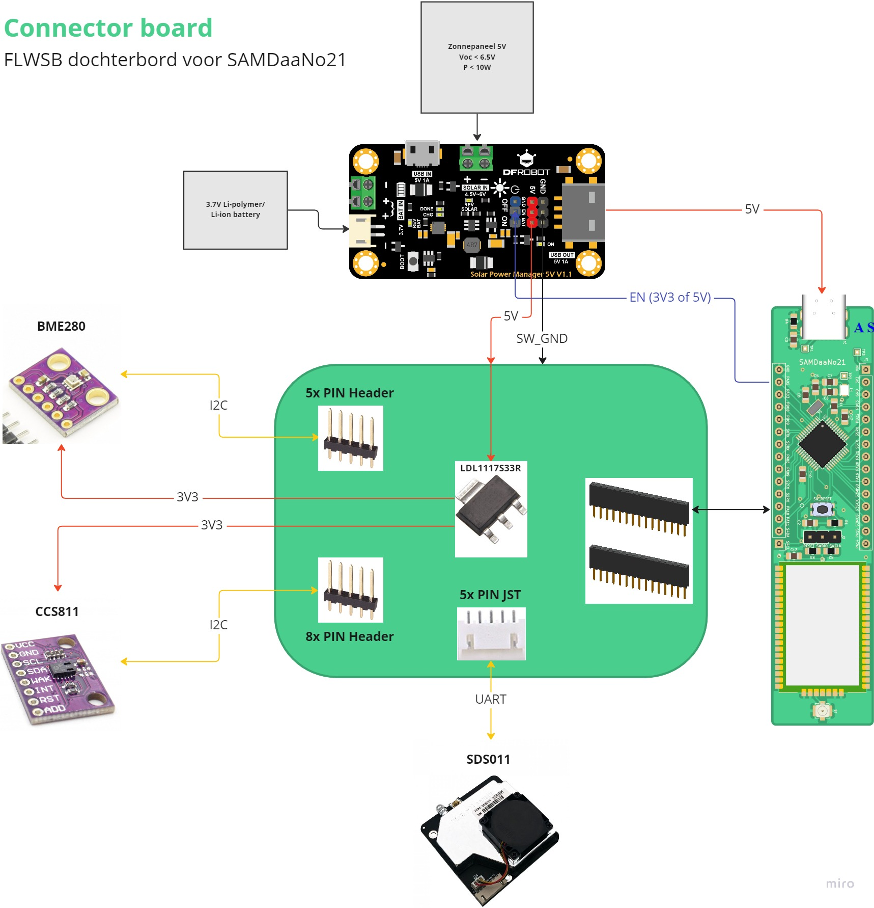

# Connector board (Dochterbord)

Het connector board is een dochterbord voor de SAMDaaNo21. Het dient als tussenschakel om allerlei onderdelen te kunnen verbinden met de SAMD21 microcontroller. De focus ligt hier ook op fast prototyping en flexibiliteit. Dit wilt zeggen dat er enkel connectoren voorzien worden en geen sensoren rechtstreeks op dit bordje zullen komen.

## Blokschema

<iframe width="600" height="600" src="https://miro.com/app/embed/uXjVPAdIy0o=/?pres=1&frameId=3458764539645645619&embedId=776892473756" frameborder="0" scrolling="no" allowfullscreen></iframe>

## Te connecteren onderdelen

- CCS811 TVOC sensor
- SDS011 fijnstof sensor
- BME280 temperatuur, barometer en luchtvochtigheid sensor
- (DHT22 temperatuur en luchtvochtigheid sensor)
- Zonne-energie manager voor continu gebruik tussen batterij en zonnenpaneel

## Sensoren

Sensor analyse uit [AirQualitySensor documentatie](https://ap-it-gh.github.io/ssys21-docs-luchtsensor/#/./pagina/Hardware/PCB) (DHT22 toegevoegd):
<table>
    <tbody><tr>
        <th>Naam</th>
        <th width="40%">Eigenschappen</th>
        <th width="30%">Argumentatie</th>
        <th>Links</th>
    </tr>
    <tr>
        <td>CCS811</td>
        <td>
            <ul>
                <li><b>Temperatuur, eCO en eTVOC2</b></li>
                <li>Vcc = 1.8V-3.3V</li>
                <li>Imax = 54mA</li>
                <li><a target="_blank" href="https://en.wikipedia.org/wiki/I%C2%B2C">I²C</a> protocol 3.3V</li>
                <li>Meetbereik temperatuur: -40°C ~ +85°C</li>
                <li>Meetbereik luchtvochtigheid: 10% ~ 95% </li>
                <li>Meetbereik eCO²: 400ppm1 ~ 32768ppm</li>
                <li>Meetbereik eTVOC: 0ppb5 ~ 29206ppb</li>
                <li>Leessnelheid: 100kHz (0.01ms)</li>
            </ul>
        </td>
        <td>Een minder bekende sensor maar zeker wel bekend in IoT toepassingen. Het kan temperatuur, eCO² en eTVOC meten. Het heeft geen opwarm tijd dus is direct bruikbaar en is ook een SMD component wat zeker een voordeel is om het zo compact mogelijk te maken.</td>
        <td>
            <a target="_blank" href="https://www.tinytronics.nl/shop/nl/sensoren/ccs811-luchtkwaliteit-sensor">Winkel</a> 
            <a target="_blank" href="https://www.sciosense.com/wp-content/uploads/documents/SC-001232-DS-2-CCS811B-Datasheet-Revision-2.pdf">Datasheet</a> 
            <a target="_blank" href="https://github.com/adafruit/Adafruit_CCS811">Bibliotheek</a>
        </td>
    </tr>
    <tr>
        <td>SDS011</td>
        <td>
            <ul>
                <li><b>Fijnstof</b></li>
                <li>Vcc = 5V</li>
                <li>Imax = 70mA ±10mA</li>
                <li><a target="_blank" href="https://en.wikipedia.org/wiki/Universal_asynchronous_receiver-transmitter">UART</a> protocol 3.3V</li>
                <li>Baudrate: 9600</li>
                <li>Meetbereik PM2.53 &amp; PM104: 0μg/m3 ~ 999.9 μg/m3</li>
                <li>Meetbereik luchtvochtigheid: 10% ~ 95% </li>
                <li>Leessnelheid: 1Hz (1s)</li>
            </ul>
        </td>
        <td>De SDS011 is een veel gebruikte fijnstof sensor voor DIY-projecten. Het zal niet de nauwkeurigste zijn, maar het geeft toch al een sterke indicatie van wat het fijnstof gehalte is in de lucht. Daarnaast het een goedkope modele.  
        Het werkt met een ventilator die de lucht binnentrekt. Het zal dus eerst moeten opgezet wordne om de huidige lucht erin te trekken vooraleer we kunnen meten.</td>
        <td>
            <a target="_blank" href="https://www.tinytronics.nl/shop/nl/sensoren/nova-sds011-hoge-precisie-laser-stofsensor">Winkel</a> 
            <a target="_blank" href="https://cdn-reichelt.de/documents/datenblatt/X200/SDS011-DATASHEET.pdf">Datasheet</a> 
            <a target="_blank" href="https://www.arduinolibraries.info/libraries/sds011-sensor-library">Bibliotheek</a>
        </td>
    </tr>
    <tr>
        <td>BME280</td>
        <td>
            <ul>
                <li><b>Temperatuur, Barometer &amp; Luchtvochtigheid</b></li>
                <li>Vcc = 3.3V</li>
                <li>Imax = 4.5mA</li>
                <li><a target="_blank" href="https://en.wikipedia.org/wiki/I%C2%B2C">I²C</a> protocol 3.3V</li>
                <li>Meetbereik temperatuur: -40°C ~ +85°C</li>
                <li>Meetbereik luchtvochtigheid: 0% ~ 100%</li>
                <li>Meetbereik luchtdruk: 300hPa ~ 1100hPa</li>
                <li>Leessnelheid: 1Hz (1s)</li>
            </ul>
        </td>
        <td>Deze IC heeft een tal van metingen aanboord (temperatuur, luchtvochtigheid en druk) en het is een SMD component, dus makkelijk integreerbaar op een pcb.</td>
        <td>
            <a target="_blank" href="https://www.tinytronics.nl/shop/nl/sensoren/temperatuur-lucht-vochtigheid/bme280-digitale-barometer-druk-en-vochtigheid-sensor-module">Winkel</a> 
            <a target="_blank" href="https://www.mouser.com/datasheet/2/783/BST-BME280_DS001-11-844833.pdf">Datasheet</a> 
            <a target="_blank" href="https://github.com/adafruit/Adafruit_BME280_Library">Bibliotheek</a>
        </td>
    </tr>
    <tr>
        <td>DHT22</td>
        <td>
            <ul>
                <li><b>Temperatuur, Luchtvochtigheid</b></li>
                <li>Vcc = 3.3-6V DC</li>
                <li>Imax = ? mA</li>
                <li>Digital signal via single-bus (zie datasheet)</li>
                <li>Meetbereik temperatuur: -40°C ~ +80°C</li>
                <li>Meetbereik luchtvochtigheid: 0% - 100%</li>
                <li>Leessnelheid: ~2s</li>
            </ul>
        </td>
        <td>Een handige temperatuur én vochtigheid sensor.</td>
        <td>
            <a target="_blank" href="https://www.tinytronics.nl/shop/nl/sensoren/lucht/vochtigheid/dht22-thermometer-temperatuur-en-vochtigheids-sensor">Winkel</a> 
            <a target="_blank" href="https://www.tinytronics.nl/shop/index.php?route=product/product/get_file&file=136/DHT22.pdf">Datasheet</a> 
            <a target="_blank" href="">Bibliotheek</a>
        </td>
    </tr>
</tbody></table>

## Zonne-energie manager

Eén van de doelen van het connector board is om continue stroom te kunnen voorzien. Dit door te kunnen schakelen tussen een oplaadbare batterij en een zonnepaneel die da batterij ook kan opladen.
Verder moet het ook voldoende spanning en stroom kunnen voorzien. De SAMDaaNo21 beschikt reeds over een 3V3 lineaire regelaar die gevoed kan worden via een VIN pin waarop ook een 5V USB-C poort zit. De zonne-energie manager moet best 5V kunnen leveren om sensoren op 5V ook te kunnen voeden en ook de VIN van de SAMDaaNo21.

Er wordt gekozen voor de DFRobot Zonne-energie Manager 5V v1.1 DFR0559.
Deze laat toe een heroplaadbare batterij op te laden

### Eigenschappen

- Model: DFROBOT-DFR0559
- Solar Power Management IC: CN3165
- Solar Input Voltage (SOLAR IN): 4.5V ~ 6V
  - Maximum open circuit voltage < 6.5V
- Battery Input (BAT IN): 3.7V Single cell Li-polymer/Li-ion Battery
- Charge Current(USB/SOLAR IN):
  - 900mA Max trickle charging
  - constant current
  - constant voltage three phases charging
- Charging Cutoff Voltage (USB/SOLAR IN): 4.2V ±1%
- Regulated Power Supply: 5V 1A
- Voltage Regulator IC: MT3608 DC-DC Boost 5V
- Regulated Power Supply Efficiency (3.7V BAT IN): 86% @ 50%Load
- USB/Solar Charge Efficiency: 73% @ 3.7V 900mA BAT IN
- Quiescent Current: <1 mA
- Operation Temperature: -40℃ ～ 85℃
- Dimension: 33.0mm x 63.0mm
- Protection Functions:
  - BAT IN: over charge/over discharge/over current/reverse connection protection
  - 5V/USB OUT: short circuit/over current/over heat protection
  - SOLAR IN: reverse connection protection
- Prijs: €9,50 per stuk op [TinyTronics](https://www.tinytronics.nl/shop/nl/power/bms-en-laders/zonneladers/dfrobot-zonne-energie-manager-5v)
- [DFRobot webshop pagina](https://www.dfrobot.com/product-1712.html)
- [Documentatie](https://wiki.dfrobot.com/Solar_Power_Manager_5V_SKU__DFR0559)
- [Schema](./assets/DFROBOT-DFR0559/DFR0559-schematic.pdf)

### Features

- Constant voltage MPPT algorithm, maximizing solar panel efficiency
- Designed for 5V solar panel
- Double charging mode: solar/USB charger (900mA max charge current)
- 5V ON/OFF controllable regulated power supply for low-power applications
- All-round protection functions
- USB connector with ESD shell

