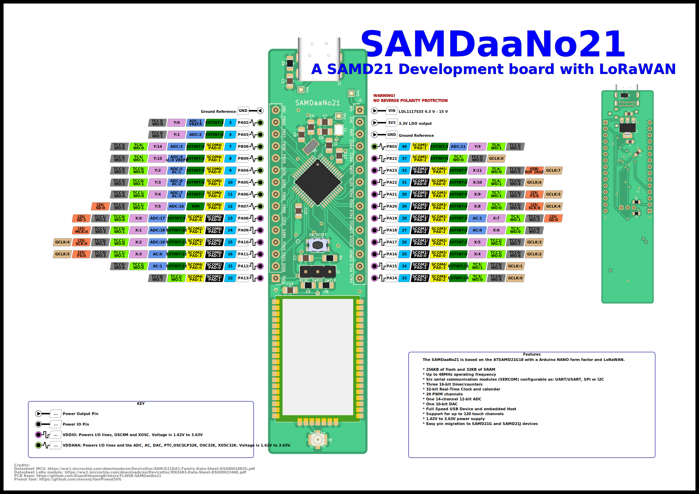

 # Flexible LoRaWAN Sensor Board SAMDaaNo21

[PDF versie van de pinout diagram](./assets/SAMDaaNo21-pinout.pdf)

Het FLWSB Main Board is een microcontroller bord gebaseerd op de ATSAM D21 in de vormfactor vergelijkbaar met een Arduino Nano. Het mot gemakkelijk zijn om dit bord in een breadboard te prikken en zo testen uit te voeren of schakelingen te bouwen. Het elektrisch schema is [hier](../schematic/main-board) te vinden.

## KiCad bibliotheken

Het is handig om een printplaat te kunnen ontwikkelen waar de SAMDaaNo21 opgeprikt kan worden.

Om dit proces te vergemakkelijken is er een KiCad bibliotheek ontwikkeld, die bevat een symbol, footprint en 3D-model.

Het is aangeraden om bibliotheken die niet standaard in KiCad zitten mee in de projectmap te steken en te importeren als projectbibliotheek. Als je je projectmap dan deelt met derden zullen zij meteen beschikken over alle nodige bibliotheken.

Tutorial: [How to import into KiCad V6 & later?](https://support.snapeda.com/en/articles/5995733-how-to-import-into-kicad-v6-later)

[SAMDaaNo21 bibliotheek bestanden](https://github.com/Dacetylan/FLWSB/tree/SAMDaaNo21/src/printed-circuit-boards/FLWSB-SAMDaaNo21-KiCad-lib)

## Testpunten

Er zijn verschillende testpunten toegevoegd om op een gemakkelijke en toegankelijke manier verschillende parameters op het bord te kunnen meten.

Er is gekozen voor through hole testpunten zodat het gemakkelijk is om deze met een probe te meten. Alle testpunten zijn te vinden nabij de USB poort.

| Testpunt nummer | Verbinding                                                   |
| --------------- | ------------------------------------------------------------ |
| TP1             | VBUS: 5 V afkomstig van USB                                  |
| TP2             | VDD: 3,3 V gereguleerde spaning                              |
| TP3             | VIN: Ingangsspanning voordat het naar de lineaire regelaar gaat |

## LoRaWAN Module

De RN2483 zit mee op de printplaat en bevindt zich aan het uiteinde. Er kan een antenne aangesloten worden via een U.FL connector.  

[Productpagina connector](https://be.farnell.com/hirose-hrs/u-fl-r-smt-1-10/rf-coaxial-u-fl-straight-jack/dp/1688077)

## USB Interface & VIN

Het bordje kan voorzien worden van stroom via de USB-C poort. Een LDO (Low Dropout regelaar) zal de spanning afkomstig van de computer reguleren naar ene stabiele 3,3 V.

De LDO is een LD1117S33 en ondersteunt een minimale ingangsspanning van 4,3 V en een maximale van 15 V. Dat kan worden aangelegd via de VIN pin. Er is een Schottky diode voorzien om ervoor te zorgen dat de spanning van VIN niet op de USB poort komt te staan.

*Let op dat je met een lineaire regelaar te maken hebt. Hoe hoger de ingangsspanning, hoe warmer de LDO zal worden!*

Het is ook mogelijk om de regelaar over te slagen en rechtstreeks 3,3 V te leveren via de 3V3 pin. Dit kan handig zijn bij een situatie waarin we zo zuinig mogelijk willen zijn en een efficiëntere 3,3 V regelaar gebruiken van een andere pcb. *Belangrijk is dat deze spanning niet te hard mag afwijken van 3,3 V!*

## RESET & DEBUG

Als er nog geen bootloader op e ATSAMD staat of als we een bare metal installatie gebruiken zullen we gebruik moeten maken van de program en debug header. Dat zijn de 3 pinnen centraal op de printplaat voor de LoRaWAN module. De pinouut van links naar recht is: RESET, SWDIO, SWCLK. 

De ATSAMD maakt gebruik van Serial Wire Debugging, dat maakt het mogelijk om via fuses in te stellen, binaries in te laden en zelfs break-points aan je code toe te voegen.

## Input / Output

Dit zijn alle GPIO, SERCOM en power aansluitingen die via pinheaders naar buiten worden gebracht. De SERCOM poorten zijn alvast gedefinieerd zodat onder andere de pull-up weerstanden geplaatst kunnen worden. Alle andere poorten zijn voor algemeen gebruik. In de datasheet van de ATSAM D21 onder 7. I/O Multiplexing and Considerations kunnen alle verschillende mogelijkheden van deze aansluitingen gevonden worden (AC, ADC, DAC, PTC, DAC, IO, ...). 

PA12 en PA13 zijn onderdeel van de I²C bus en hebben al een pull-up weerstand van 4,7 K voorzien. *Bij het plaatsen van nog externe pull-up weerstanden zullen zij in parallel staan en zal de weerstandswaarde te laag worden.*

| I/O Pin | Pin      | SERCOM                  | SERCOM-ALT     | External Interrupt | ADC, DAC, AC, REF  | Peripheral Touch Controller | TC/TCC       | TCC          | COM             | Generic Clock Generator |
| ------- | -------- | ----------------------- | -------------- | ------------------ | ------------------ | --------------------------- | ------------ | ------------ | --------------- | ----------------------- |
| GND     | PowerPin | Ground Reference        |                | EXTINT:2           | ADC:0 VOUT       |                             |              |              |                 |                         |
| PA02    | 3        |                         |                | EXTINT:3           | ADC:1 VREFA      | Y:0                         |              | TCC3/ WO:0 |                 |                         |
| PA03    | 4        |                         |                | EXTINT:8           | ADC:2              | Y:1                         |              | TCC3/ WO:1 |                 |                         |
| PB08    | 7        |                         | SCOM4/ PAD:0 | EXTINT:9           | ADC:3              | Y:14                        | TC4/ WO:0  | TCC3/ WO:6 |                 |                         |
| PB09    | 8        |                         | SCOM4/ PAD:1 | EXTINT:4           | ADC:4 AC:0 VREFB | Y:15                        | TC4/ WO:1  | TCC3/ WO:7 |                 |                         |
| PA04    | 9        |                         | SCOM0/ PAD:0 | EXTINT:5           | ADC:5 AC:1       | Y:2                         | TCC0/ WO:0 | TCC3/ WO:2 |                 |                         |
| PA05    | 10       |                         | SCOM0/ PAD:1 | EXTINT:6           | ADC:6 AC:2       | Y:3                         | TCC0/ WO:1 | TCC3/ WO:3 |                 |                         |
| PA06    | 11       |                         | SCOM0/ PAD:2 | EXTINT:7           | ADC:7 AC:3       | Y:4                         | TCC1/ WO:0 | TCC3/ WO:4 |                 |                         |
| PA07    | 12       |                         | SCOM0/ PAD:3 | NMI                | ADC:16             | Y:5                         | TCC1/ WO:1 | TCC3/ WO:5 | I2S/ SD:0     |                         |
| PA08    | 13       | SCOM0/ PAD:0          | SCOM2/ PAD:0 | EXTINT:9           | ADC:17             | X:0                         | TCC0/ WO:0 | TCC1/ WO:2 | I2S/ SD:1     |                         |
| PA09    | 14       | SCOM0/ PAD:1          | SCOM2/ PAD:1 | EXTINT:10          | ADC:18             | X:1                         | TCC0/ WO:1 | TCC1/ WO:3 | I2S/ MCK:0    |                         |
| PA10    | 15       | SCOM0/ PAD:2          | SCOM2/ PAD:2 | EXTINT:11          | ADC:19             | X:2                         | TCC1/ WO:0 | TCC0/ WO:2 | I2S/ SCK:0    | GCLK:4                  |
| PA11    | 16       | SCOM0/ PAD:3          | SCOM2/ PAD:3 | EXTINT:12          | AC:0               | X:3                         | TCC1/ WO:1 | TCC0/ WO:3 | I2S/ FS:0     | GCLK:5                  |
| PA12    | 21       | SCOM2/ PAD:0          | SCOM4/ PAD:0 | EXTINT:13          | AC:1               |                             | TCC2/ WO:0 | TCC0/ WO:6 |                 |                         |
| PA13    | 22       | SCOM2/ PAD:1          | SCOM4/ PAD:1 |                    |                    |                             | TCC2/ WO:1 | TCC0/ WO:7 |                 |                         |
| VIN     | PowerPin | LDL1117S33 4.3 V - 15 V |                |                    |                    |                             |              |              |                 |                         |
| 3V3     | PowerPin | 3.3V LDO output         |                |                    |                    |                             |              |              |                 |                         |
| GND     | PowerPin | Ground Reference        |                |                    |                    |                             |              |              |                 |                         |
| PB03    | 48       |                         | SCOM5/ PAD:1 | EXTINT:3           | ADC:11             | Y:9                         | TC6/ WO:1  | TCC3/ WO:3 |                 |                         |
| PB22    | 37       |                         | SCOM5/ PAD:2 | EXTINT:6           |                    |                             | TC7/ WO:0  | TCC3/ WO:0 |                 | GCLK:0                  |
| PA23    | 32       | SCOM3/ PAD:1          | SCOM5/ PAD:1 | EXTINT:7           |                    | X:11                        | TC4/ WO:0  | TCC0/ WO:5 | USB/ SOF 1KhZ | GCLK:7                  |
| PA22    | 31       | SCOM3/ PAD:0          | SCOM5/ PAD:0 | EXTINT:6           |                    | X:10                        | TC4/ WO:1  | TCC0/ WO:4 |                 | GCLK:6                  |
| PA21    | 30       | SCOM5/ PAD:3          | SCOM3/ PAD:3 | EXTINT:5           |                    | X:9                         | TC7/ WO:1  | TCC0/ WO:7 | I2S/ FS:0     | GCLK:5                  |
| PA20    | 29       | SCOM5/ PAD:2          | SCOM3/ PAD:2 | EXTINT:4           |                    | X:8                         | TC7/ WO:0  | TCC0/ WO:6 | I2S/ SCK:0    | GCLK:4                  |
| PA19    | 28       | SCOM1/ PAD:3          | SCOM3/ PAD:3 | EXTINT:3           | AC:1               | X:7                         | TC3/ WO:1  | TCC0/ WO:3 | I2S/ SD:0     |                         |
| PA18    | 27       | SCOM1/ PAD:2          | SCOM3/ PAD:2 | EXTINT:2           | AC:0               | X:6                         | TC3/ WO:0  | TCC0/ WO:2 |                 |                         |
| PA17    | 26       | SCOM1/ PAD:1          | SCOM3/ PAD:1 | EXTINT:1           |                    | X:5                         | TCC2/ WO:1 | TCC0/ WO:7 |                 | GCLK:3                  |
| PA16    | 25       | SCOM1/ PAD:0          | SCOM3/ PAD:0 | EXTINT:0           |                    | X:4                         | TCC2/ WO:0 | TCC0/ WO:6 |                 | GCLK:2                  |
| PA15    | 24       | SCOM2/ PAD:3          | SCOM4/ PAD:3 | EXTINT:15          |                    |                             | TC3/ WO:1  | TCC0/ WO:5 |                 | GCLK:1                  |
| PA14    | 23       | SCOM2/ PAD:2          | SCOM4/ PAD:2 | EXTINT:14          |                    |                             | TC3/ WO:0  | TCC0/ WO:4 |                 | GCLK:0                  |

### Legende

`SERCOM`: Serial Communication, keuze tussen: USART, I²C, SPI of SMBus

`EXTINT[n]`: External Interrupts

`AIN[n]`: ADC Analog Inputs

`X[n]`, `Y[n]`: Peripheral Touch Controller - PTC Input

`TC4/WO[n]`, `TC6/WO[n]`: Waveform/PWM Outputs

`TCC3/WO[n]`: Waveform/PWM Outputs/ Capture Inputs 

`AC/CMP[n]`: AC Comparator Outputs

`I2S/FS[n]`: Inter-IC Sound Controller, I²S Word Select or TDM Frame Sync

`GCLK_IO[n]`: Generic Clock (source clock or generic clock generator output)

## Toekomstige verbeteringen

- Momenteel zijn er geen mounting holes aanwezig, dat vonden we momenteel nog niet prioritair.
  - Mouning holes of inkepingen aan de randen van de printplaat zijn dus nog mogelijk.
- De impedantie van het pad naar de antenne aansluiting is niet theoretisch berekend. dit is iets waar in een volgende versie over kan worden nagedacht
- Er is geen LED aanwezig

### Bill of Materials
[poc board bill of materials](assets/bom/ibom.html ':include :type=iframe width=100% height=1024px')

