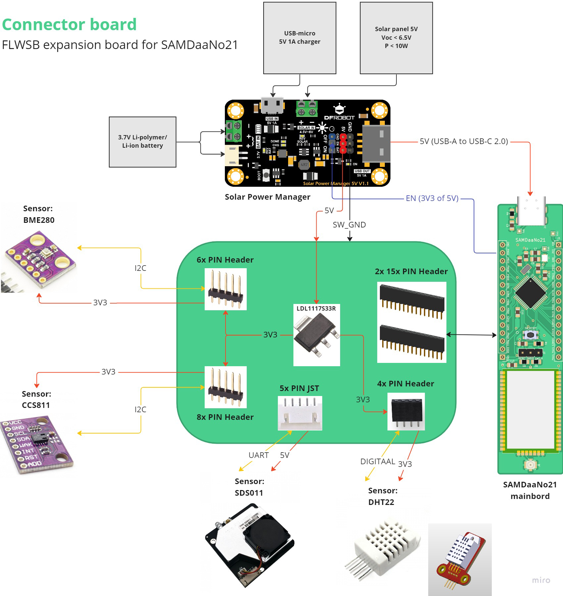

# Connector board

Het connector board dient als verbindingspunt voor de SAMDaaNo21. Het is de tussenschakel om allerlei onderdelen te kunnen verbinden met de SAMD21 microcontroller. De focus ligt hier ook op fast prototyping en flexibiliteit. Dit wilt zeggen dat er enkel connectoren voorzien worden en geen sensoren rechtstreeks op dit bord zullen komen.

## Schema

## Blokdiagram

*Note: in het ontwerp moet rekening gehouden worden met mechanische sterkte. De SAMDaaNo21 wordt gevoed via USB kabel. Deze kan echter loskomen. Dit moet voorkomen worden door het design.*

### Te connecteren onderdelen

- SAMDaaNo21 moederbord
- Zonne-energie (Solar Power) manager voor continu gebruik tussen batterij en zonnenpaneel.
- Sensoren:
  - [CCS811](https://www.sciosense.com/products/environmental-sensors/ccs811/): TVOC sensor met I2C op 1V8-3V3
  - [SDS011](https://www.tinytronics.nl/shop/nl/sensoren/lucht/stof/nova-sds011-hoge-precisie-laser-stofsensor): fijnstof sensor met UART 3V3 op 5V
  -  [BME280](https://www.bosch-sensortec.com/products/environmental-sensors/humidity-sensors-bme280/): temperatuur, barometer en luchtvochtigheid sensor met I2C op 1V8-3V3
  - ([DHT22](https://www.tinytronics.nl/shop/nl/sensoren/lucht/vochtigheid/dht22-thermometer-temperatuur-en-vochtigheids-sensor): temperatuur en luchtvochtigheid sensor alternatief met Digitale I/O op 3V3-6V)

### Uitbreidingsmogelijkheden

- 2x Extra I2C 3V3 met 3V3 voeding
- 1x Extra I2C met 5V voeding
- 1x Extra UART 3V3 met 3V3 voeding
- Mogelijke sensoren:
  - [SCD41](https://sensirion.com/products/catalog/SCD41/): CO2 met I2C op 3V3-5V
  - [SGP41](https://sensirion.com/products/catalog/SGP41/): TVOC en NOx met I2C op 1V8-3V3
  - [SPS30](https://sensirion.com/products/catalog/SPS30/): HVAC PM1.0, PM2.5, PM4 en PM10 met I2C en UART op 5V
  - [GY-NEO6MV2](https://www.tinytronics.nl/shop/nl/communicatie-en-signalen/draadloos/gps/modules/gy-neo6mv2-gps-module): GPS met UART 3V3 op 3V3-5V

### Stroomverbruik

Stroomverbruik per onderdeel en maximum wanneer alles aan is.

| Component | Stroomverbruik in operatie | Start-up | Meet periode | Stroomverbruik standby |
| --- | --- | --- | --- | --- |
| ATSAMD21G18A | I = 1 - 6 mA | n/a | n/a | I25-85° = 2.70 - 55.2µA |
| LDL1117S33R | ? | n/a | n/a | IQ typ. = 250µA
| CCS811  | IDD = 30mA , IDD peak = 54mA | 18 - 20ms | ? | IDD = 19µA |
| SDS011  | Irated = 70mA ±10mA | ? | <10s + 1s read | I < 4mA |
| BME280  | IDD H/P/T (1V8) = 340 / 714 / 350µA , Iweather monitoring mode = 0.16µA | 2ms | <1s | IDD SB (1V8-3V6) = 0.2 - 0.5µA |
| DHT22  | Imeasuring (3V3) = 1mA | 1s | >2s | Istand-by (3V3) = 40µA |

*IQ = [Quiescent current](https://forum.digikey.com/t/what-is-quiescent-current-and-why-is-it-important/3894)*

Imax. totaal = 6mA + (250µA * 2) + 54mA + 80mA + 714µA + 1mA

__Imax. totaal = 142.214 mA__

---

#### Notes from the CCS811 datasheet

> Modes of Operation
The CCS811 has 5 modes of operation as follows
- Mode 0: Idle, low current mode
- Mode 1: Constant power mode, IAQ measurement every
second / 1 seconds
- Mode 2: Pulse heating mode IAQ measurement every 10
seconds
- Mode 3: Low power pulse heating mode IAQ
measurement every 60 seconds
- Mode 4: Constant power mode, sensor measurement
every 250ms

> In Modes 1, 2, 3, the equivalent CO2 concentration (ppm) and
eTVOC concentration (ppb) are calculated for every sample.
- Mode 1 reacts fastest to gas presence, but has a higher
operating current
- Mode 3 reacts more slowly to gas presence but has the
lowest average operating current.

> When a sensor operating mode is changed to a new mode with a
lower sample rate (e.g. from Mode 1 to Mode 3), it should be
placed in Mode 0 (Idle) for at least 10 minutes before enabling
the new mode. When a sensor operating mode is changed to a
new mode with a higher sample rate (e.g. from Mode 3 to Mode
1), there is no requirement to wait before enabling the new
mode.

> Mode 4 is intended for systems where an external host system
wants to run an algorithm with raw data and this mode provides
new sample data every 250ms. Mode 4 is also recommended
for end-of-line production test to save test time. For additional
information please refer to application note ScioSense
AN000373: CCS811 Factory test procedure.

---
