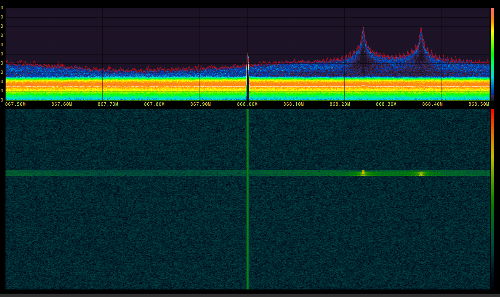
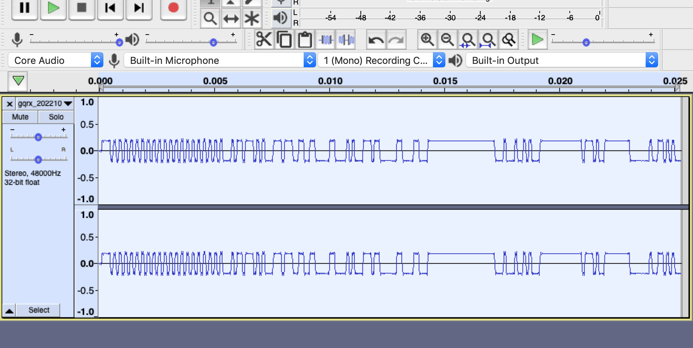
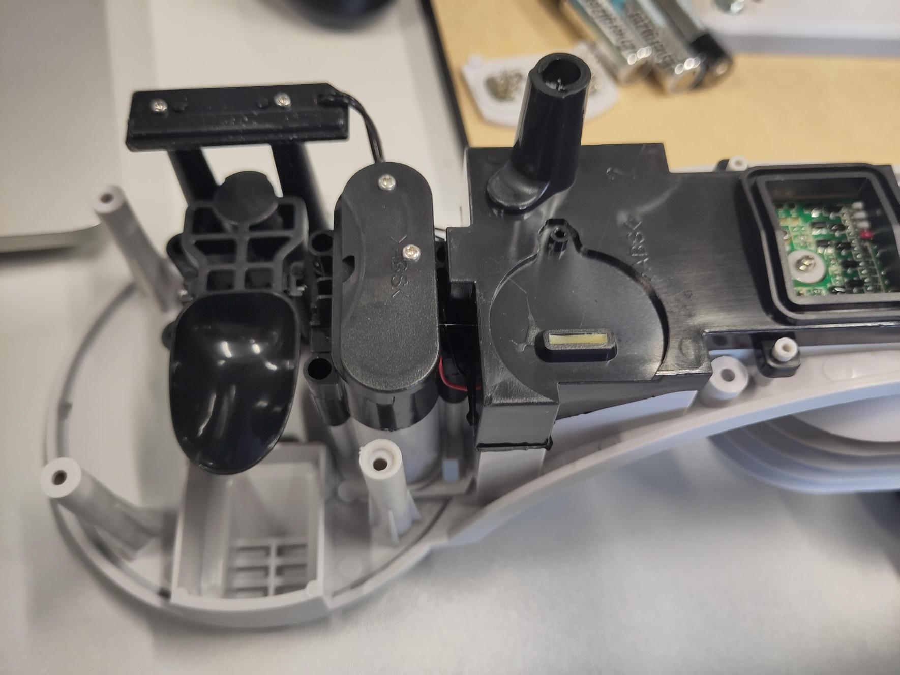
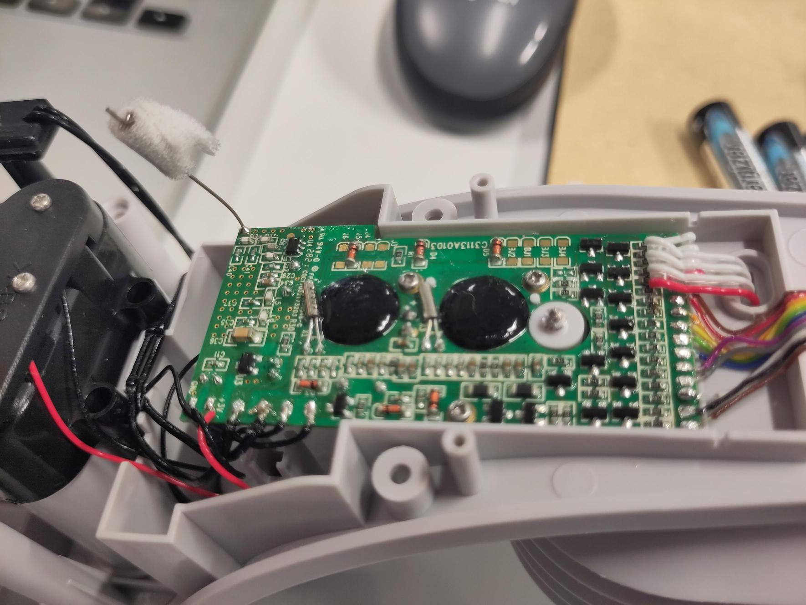
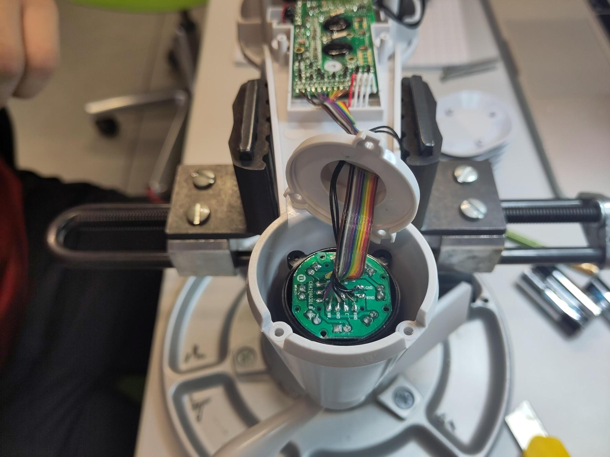
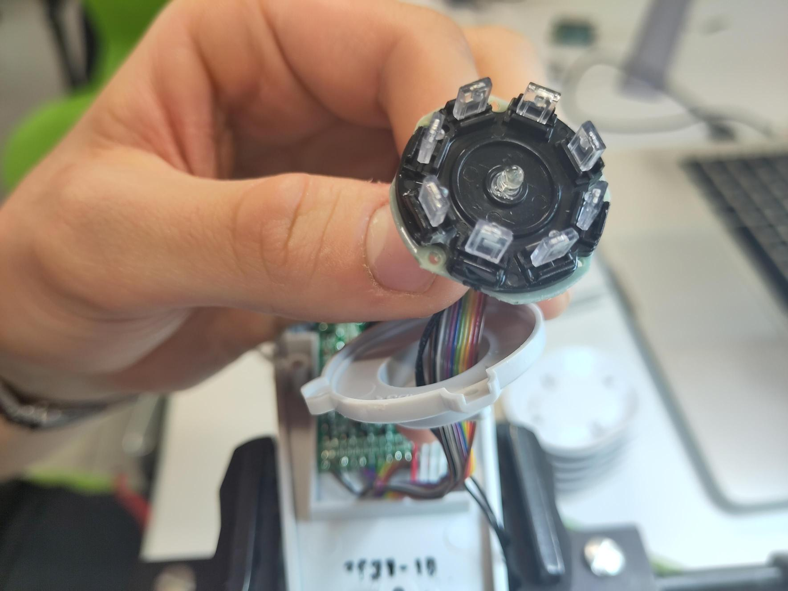

# Weerstation

## Reverse Engineering Onderzoek

### Introductie

Om snel aan bruikbare data te geraken maken we gebruik van een bestaand draadloos weerstation.
Dit is de [Alecto WS-4800](https://alectohome.nl/products/alecto-ws-4800-professioneel-weerstation-met-draadloze-buitensensor-wit) wat eigenlijk een Nederlandse rebranding is van de [Bresser 5-in-1 New](https://www.bresser.de/nl/bresser-bresser-3/Weercenters/BRESSER-Weather-Center-5-in-1-wit.html).
Deze werkt aan de hand van 868MHz waarmee de data van de buitensensoren naar de scherm module worden gestuurd.
Deze zending kan onderschept worden en zo kan de data naar de backend gestuurd worden waar de data wordt bijgehouden in een database.


*fig. 1, Alecto WS-4800 weerstation*


*fig. 2, Bresser 5-in-1 (New) weerstation*

### Op voorhand:

- In het hoofdstuk Data Formatting onder [Data Overzicht](../data-formatting/data-overzicht.md) staat er in detail beschreven welke data er wordt verzameld door het weerstation.

- Er is een [bestaand project](https://www.skyon.be/maak-je-weerstation-geconnecteerd-en-slim/) met hetzelfde weerstation. Dit wordt gebruikt als referentie.

### Hands on:

#### Weerstation opbouwen en uittesten

We krijgen data binnen van het weerstation op de GUI dat meekwam met het weerstation.

#### [Dit project](https://www.skyon.be/maak-je-weerstation-geconnecteerd-en-slim/) volgen stap voor stap

We hebben het commando hieronder uitgevoerd. We hebben de parameters ingevuld met onze eigen mqtt server. Jammer genoeg zagen we geen data binnen komen op de mqtt server.

```
/usr/local/bin/rtl_433 -R 119 -f 868M -s 1024k -F mqtt://<mqtt_server_ip> 1883 retain 0 devices rtl_433[/id]
```

We weten niet goed wat er mis gaat met de RTL-SDR. Hier moet meer mee gexperimenteerd worden.

#### Met een HackRF proberen onderscheppen

Met behulpt van GQRX heb ik ontdekt dat het weerstation werkt op 868.3MHz

Ik heb dan geprobeerd om dit signaal te demoduleren. Ik kreeg het signaal niet gedemoduleerd omdat ik dit [bestaande project](https://github.com/andreafabrizi/BresserWeatherCenter) aan het volgen was.

Daar werd vermeld dat een gelijkaardig weerstation AM modulatie gebruikte. Ik had toen geprobeerd om dit signaal te demoduleren. Dat was niet gelukt.

Ik heb toen [hier](https://github.com/merbanan/rtl_433/blob/master/src/devices/bresser_5in1.c) in de comments gevonden dat het weerstation eigenlijk FSK-PCM modulatie gebruikt.

Ik heb nu twee bronnen dat verschillende info geven over hetzelfde product. Ik heb toen in GQRX geprobeerd met FM demodulatie, dat was niet succesvol. Met WFM had ik het signaal wel succesvol gedemoduleerd.



*fig. 3, GQRX spectrum analyse*



*fig 4, WFM gedemoduleerd signaal*

Nu dat ik een gedemoduleerd signaal heb is de volgende stap om dit om te zetten naar stream van bits zodat deze geanalyseerd kunnen worden.

#### Weerstation open maken

We hebben het weerstation open gemaakt om zo toch al een alternatief te onderzoeken voor als de data niet makkelijk onderschept kan worden met een SDR.


*fig 5, Overzicht weerstation onderdelen*

Op de bovenstaande foto heb ik een aantal onderdelen een kleur gegeven.

- **Rood**: Dit onderdeeel meet de hoeveelheid regen dat gevallen is

- **Blauw**: In dit onderdeel zitten de PCB's die verantwoordelijk zijn voor het bewerken en versturen van de data vanuit de sensoren

- **Groen**: Dit onderdeel is verantwoordelijk voor de metingen rond vochtigheid en temperatuur

- **Paars**: Dit is een anemometer. Hier wordt de windsnelheid en richting gemeten.


*fig 6, Weerstation binnenkant*


*fig 7, Regenmeter binnenkant foto 1*



*fig 8, Regenmeter binnenkant foto 2*

##### Regenmeter

De regenmeter werkt met een simpel principe. Als het lepeltje opgevuld is dan kantelt het en valt al het water eruit. Door deze kantelbeweging kan een magnetische sensor een magneet detecteren en dus detecteren dat er een bepaalde hoeveelheid regen gevallen is (deze hoeveelheid is de inhoud van het lepeltje)

##### PCB



*fig 9, PCB van weerstation*

Op de PCB van het weerstation is niet veel te zien. Het is duidelijk waar de antenne is en waar de data van de sensoren binnekomt. Het is niet duidelijk welke microcontroller er gebruikt wordt omdat deze gecoat zijn met een zwarte beschermende laag.

##### Anemometer



*fig 10, Windrichting binnenkant foto 1*



*fig 11, Windrichting binnenkant foto 2*

De windrichting wordt op een interessante manier gelezen. Er is een cirkelvormige array van IR receivers. Deze passen in een vorm waar een gat in zit. Afhankelijk van de positie van deze vorm zullen er enkel 1 of 2 IR receivers tegelijk werken. Daaruit kan je afleiden in welke orientatie dat de wind zit.


*fig 12, Anemometer*

Dit is een soort van magnetische sensor dat gebruikt wordt om de de windsnelheid te meten. Het werkt gelijkaardig aan de werking van een speedometer op een fiets.
